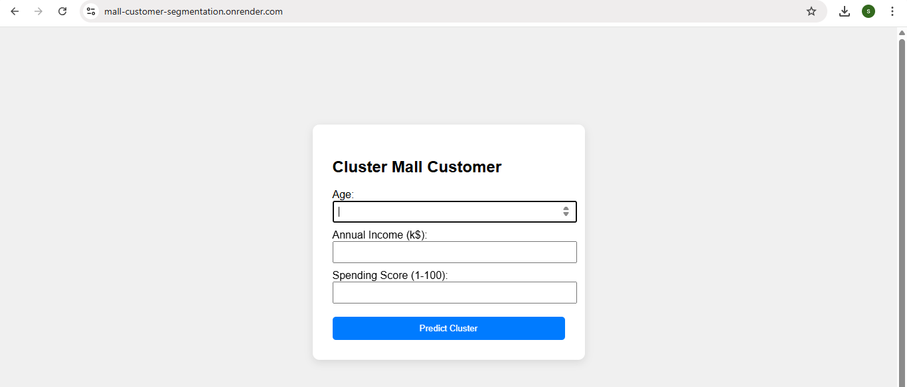
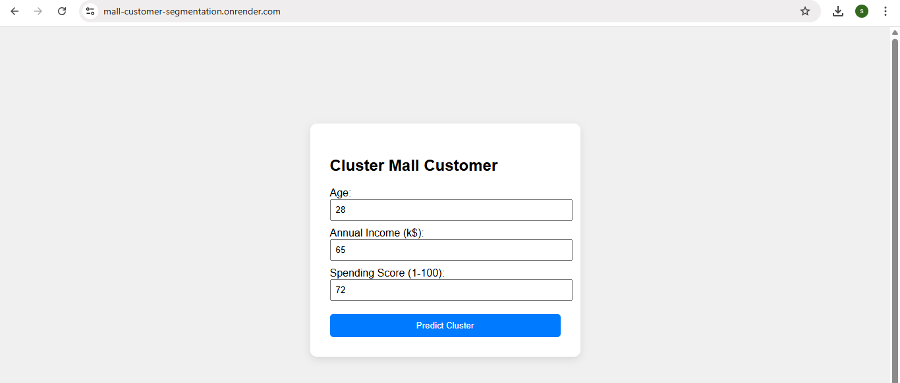
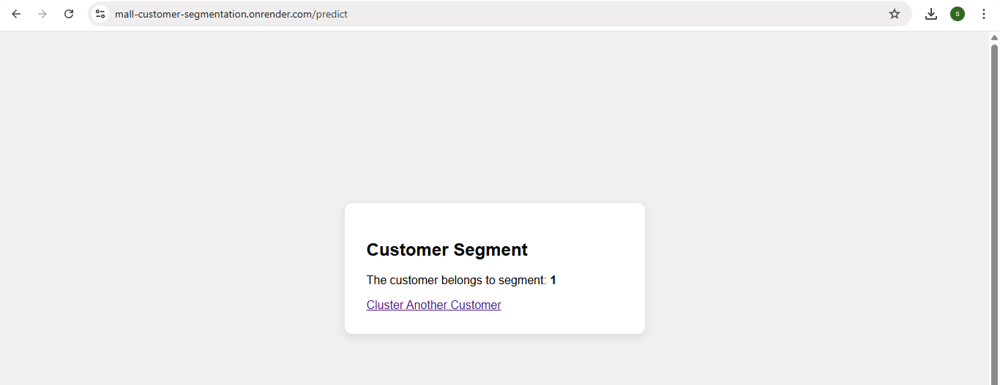

# Mall-Customer-Segmentation

This web application segments mall customers into distinct groups using the **K-Means Clustering algorithm**. It takes input such as Age, Annual Income, and Spending Score, then predicts the customer’s cluster based on their behavior and profile. The app helps identify patterns among shoppers for targeted marketing and business insights.

---

## Features

- Accepts customer inputs through a user-friendly web form.
- Uses Age, Annual Income, and Spending Score as input features.
- Applies standard scaling to normalize the input data.
- Assigns customers to one of the predefined clusters using K-Means.
- Displays the predicted customer segment instantly.

---

## Prerequisites

Make sure the following are installed:

- Python 3.7 or higher installed
- Git installed and configured
- Basic knowledge of Python and Flask
- A GitHub account (for code hosting)
- Render account (for deployment)

---

## Installation

### 1. Clone the repository

```
git clone https://github.com/sandhiya0147/Mall-Customer-Segmentation.git
cd Mall-Customer-Segmentation
```

### 2. Install dependencies

```
pip install -r requirements.txt
```

---

## Running the Application

Start the Flask development server:

```
python app.py
```

Then open your browser and go to:

```
http://127.0.0.1:5000
```

---

## How It Works

- User enters customer details: Age, Income, and Spending Score.
- The app collects and structures the input into a DataFrame.
- Data is scaled using the same scaler used during training.
- The trained K-Means model predicts the customer’s cluster.
- The assigned cluster (segment) is shown on the result page.

---

## File Structure

```
Mall-Customer-Segmentation/
├── assets/                     
│   ├── filled_input.png
│   ├── input_form.png
│   └── predicted_result.png
│
├── static/                      
│   └── style.css
│
├── templates/                   
│   └── index.html
│
├── customer_data.csv                     
├── Procfile                     
├── README.md                    
├── app.py                       
├── model.pkl                    
├── model_train.py              
├── requirements.txt                         
```

---

## Future Improvements

- Add visualizations to show cluster positions using scatter plots or 3D graphs.
- Include more features like gender, loyalty score, or time spent in the mall.
- Enable bulk input via CSV upload for batch customer segmentation.
- Display cluster profiles with descriptive labels (e.g., "High Spenders").
- Integrate with a database to store and analyze historical clustering results.

---


## Step-by-Step Guide: How to Use the Movie Interest Predictor


### Step 1: Input Form
  

### Step 2: Filled Form 
  

### Step 3: Prediction Result


---

## Live Demo

[Click here to view the deployed app](https://mall-customer-segmentation.onrender.com)

---

